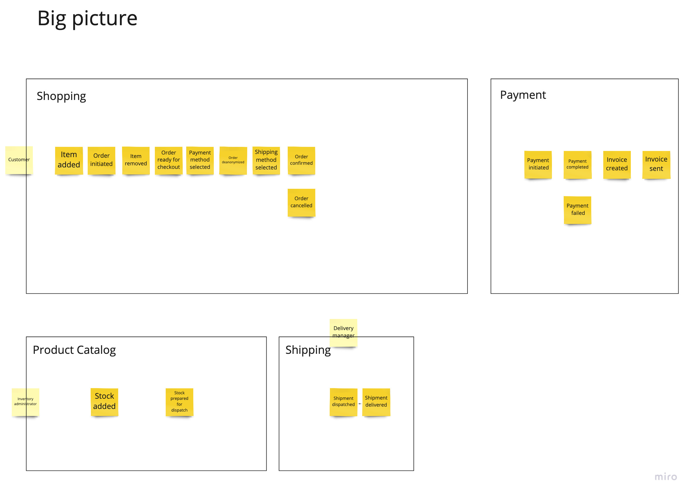
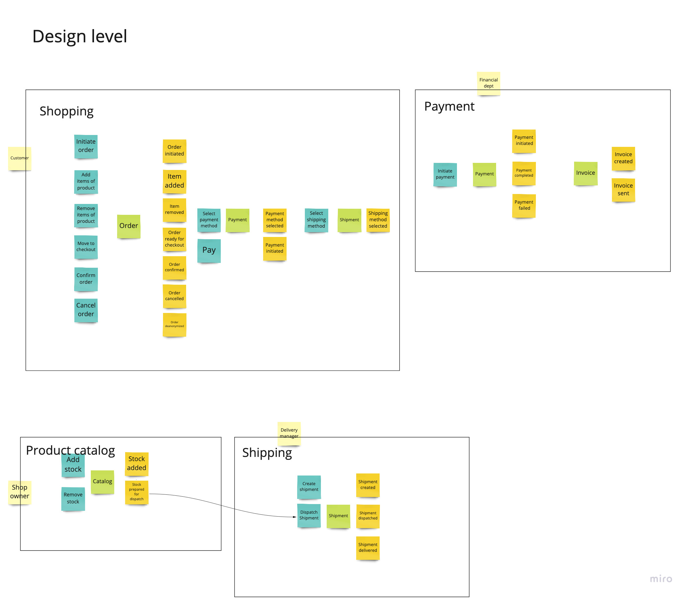

# demo-commerce

Demo commerce is an opinionated e-commerce solution implemented with event-driven microservices. 

This project serves eduactional purposes only. None of the featured microservices is meant to be used in a production environment. The main point here is for me to have some fun while trying out "eventstorming-like" modeling and applying DDD.

This concrete repository contains only description of some of the problems which a fictious online shop would be dealing with. The individual microservies mentioned in the context map are available in separate repositories. Each of them is purposfully developed in a different style with the goal to explore a given subdomain or a solution to a technical problem. For example the [shopping-service](https://github.com/gkosharovdev/axon-kafka-spring-boot) (ft. a checkout process) is showcasing the Eventsourcing+CQRS patterns with the help of the Axon framework.

## Domain model

The approach to go from problem space to solution space is loosely following the guidelines from [Alberto Brandolini's book](https://www.eventstorming.com/book). I find it cool because it encourages people to think from the perspective of the actors interacting with the system. Always having in mind their experience is bound to produce a useful model.
Here are the 3 steps:
1. Create a "Big picture" featuring the most relevant processes along with respective actors
2. Transform into a "Design level" artefact witch contains the bare minimum (e.g Events, Aggregates, Policies, etc.) necessary to reason about the implemnetaion
3. Code a bit, see if it sticks and iterate over the big picture and the design

This last step 3 may seem a bit vague, but I think it's important to set up a feedback loop between implementation and design because more often than not logical flows tend to surfice while coding.

The first version of the shopping experience is going to be something very basic. It features a checkout process, payment, shipment and a catalog. The goal here would be not to have the most comprehensive set of features but rather see how those components can collaborate through `Domain Events`.
Speaking of domain event, let's quickly recap on what it is. A `Domain event` as a domain relevant fact of businesss which happened in the past. It is expressed using a past-tense verb - e.g. `Order Placed`. Sometimes I see passive voice being used like so `Order Has Been/Was Placed`.
Cool thing about events is by favouring the principle `Tell! Don't ask!` they promote low coupling in our distributed system. This does not mean that caution is not to be exercised during modeling. It is possible sometimes to get mislead and try to model a request-response style of exchange between independent services and still call that "events". A very notable give away of such a pitfall is a situation where a given service emits and event representing a relevant local state transition and expects/awaits that a consumer service processes this event and emits another one as a reaction to it. In such case it might be useful to challenge the boundaries of those services along with the events themselves.

### Big picture

### Design level

### Implementation

